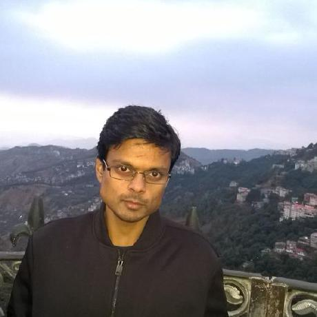

I am from [Kolkata, India](https://en.wikipedia.org/wiki/Kolkata). I have been
working in tech industry since 5 years. My specialities are Drupal, PHP and
JavaScript.

I like to learn new technologies. Nowadays, I am more inclined towards learning
software design patterns, and implement them using a programming language.

I work as a Developer (Contractor) at [Acro Media Inc](https://www.acromediainc.com).
I am always interested in working for product based services. See my
qualifications and past working history [here](https://docs.google.com/document/d/1PC7lONs7Y5QoEKbOdaQqeTVTuiNM6maUVE75oKQu644/edit?usp=sharing).

I play with code a lot, you can see them at [GitHub](https://github.com/subhojit777).
Like my work? [Hire me](mailto:subhojitpaul21@gmail.com).

I am an open source envangelist. Drupal is the first open source project that I
came across, and I am contributing to the project too. I like to help people,
well... as far as my schedule allows :blush:

Besides coding, I like hanging out with friends, play games on my beloved
PlayStation 4, music (Bollywood, [Hard Rock](http://en.wikipedia.org/wiki/Hard_rock),
[Metal](http://en.wikipedia.org/wiki/Heavy_metal_music)), movies
([IMDb top 250](http://www.imdb.com/chart/top)), cooking. I am a health freak
but a foodie too :wink: Follow me on
[Twitter](https://twitter.com/_subhojit_paul) if you want to know what I am up
to :smile:
