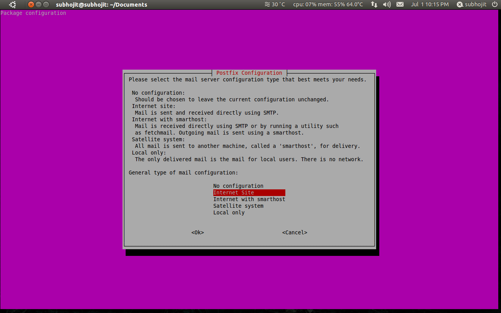
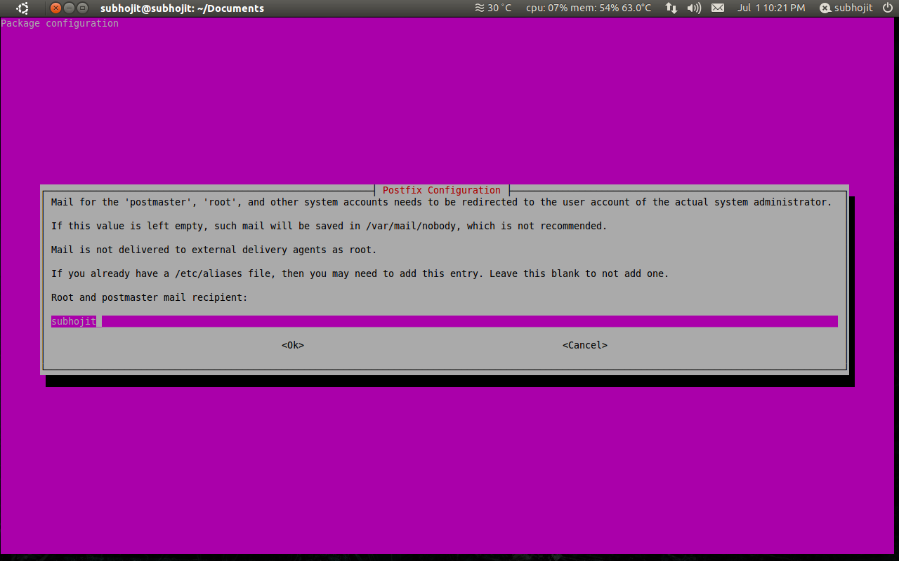
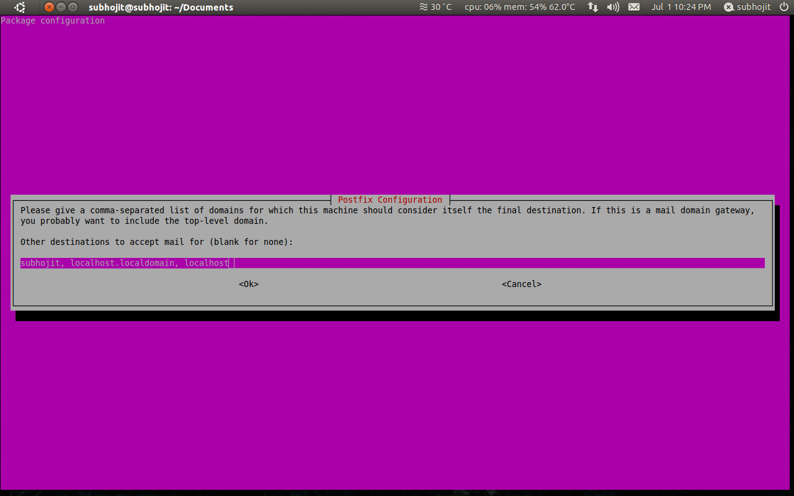
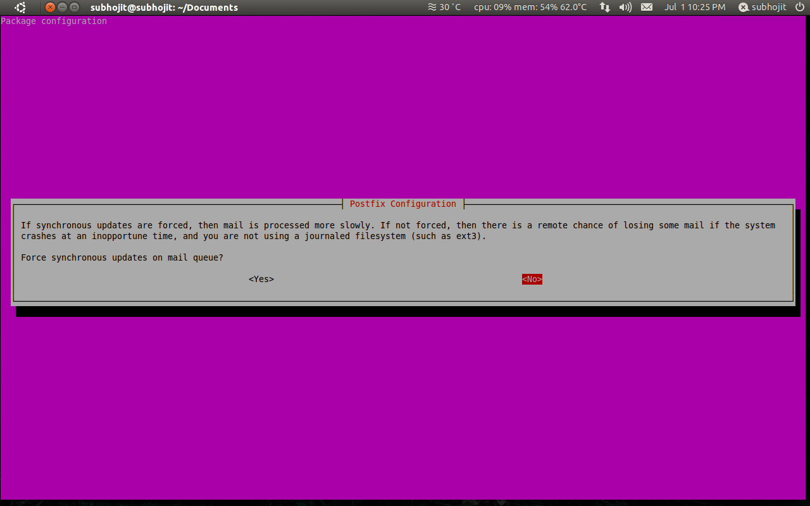
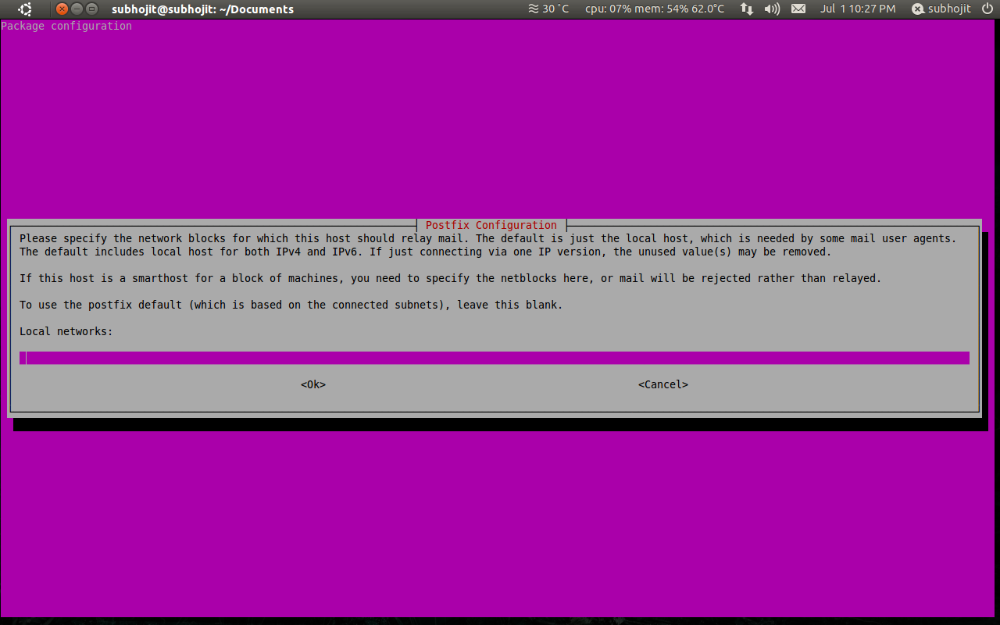
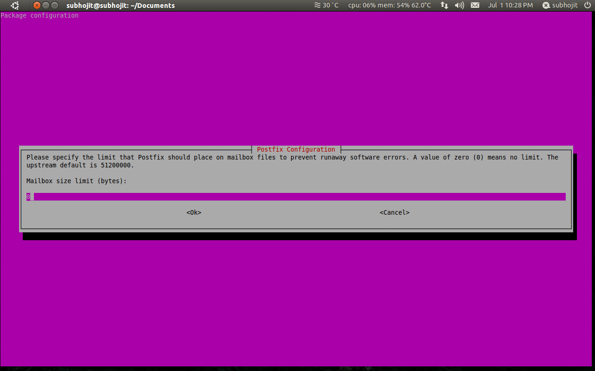
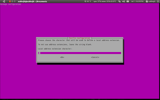
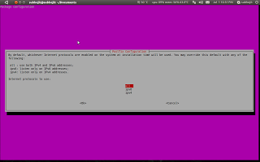

Drupal newbies trying to send mails from the Drupal contact form or using [drupal_mail()](http://api.drupal.org/api/drupal/includes!mail.inc/function/drupal_mail), usually gets this error message “Unable to send e-mail. Contact the site administrator if the problem persists.”. This is because your system is not configured to send emails.
[drupal_mail()](http://api.drupal.org/api/drupal/includes!mail.inc/function/drupal_mail) calls the PHP [mail()](http://php.net/manual/en/function.mail.php) function to send emails, hence this article can also be useful to those PHP programmers who do not use Drupal as CMS.
To send e-mail, you need to install and configure postfix in your Ubuntu machine.

**What is postfix?**

> Postfix is the default Mail Transfer Agent (MTA) in Ubuntu. It attempts to be fast and easy to administer and secure. It is compatible with the MTA sendmail.

For further reading see this [page](https://help.ubuntu.com/10.04/serverguide/postfix.html)

To install postfix enter the following codes:

```bash
sudo apt-get install php-pear
sudo pear install mail
sudo pear install Net_SMTP
sudo pear install Auth_SASL
sudo pear install mail_mime
sudo apt-get install postfix
```

This will install required packages and postfix in you Ubuntu machine.
For users who have postfix already installed in their system will get a  message that "postfix is already installed".
Configure postfix using the following command:
```bash
sudo dpkg-reconfigure postfix
```

After you enter the command you will be asked certain questions. Most of the answers will be their default answers, but since you may be new to networking I have also specified the answers with their explanations.

*   The first question will ask you to enter mail server configuration type. The options with their details are listed there. Choose “Internet Site” option since you would like to send and recieve mails using SMTP.

    [](../images/post_6/internet-setting.png)

*   The next question asks you to specify mail name. The default will be the username. Do not change it and move to the next question.

*   Next question asks you to enter the name by which you will recieve mails. The details are listed there. You will want that mails sent to you are saved in `/var/mail/<your-username>`, so do not change the default answer i.e. your username.

    [](../images/post_6/username-setting.png)


*   The next question asks you to enter the IP address from where you can accept mails. The defaults will be your username and localhost. Since, you will sending mails from you localhost Drupal site so do not change default answer and move to the next question.

    [](../images/post_6/localhost-setting.png)

*   In the next question choose the default answer “no”.

    [](../images/post_6/answer-setting.png)

*   In the next question you are asked to enter the IP addresses which you want to block. Default answer are your localhost IP address i.e 127.0.0.1. So, you have to clear this field.

    [](../images/post_6/ipaddress-setting.png)

*   Select the default answer 0 in mailbox size limit.

    [](../images/post_6/mailbox-setting.png)

*   Select the default answer in next question and do not make any changes in the field.

    [](../images/post_6/extension-setting.png)

*   Select “all” in next question.

    [](../images/post_6/protocol-setting.png)

Postfix in your Ubuntu machine is now configured and now you can send mail from Drupal's contact form or using [drupal_mail()](http://api.drupal.org/api/drupal/includes!mail.inc/function/drupal_mail).
