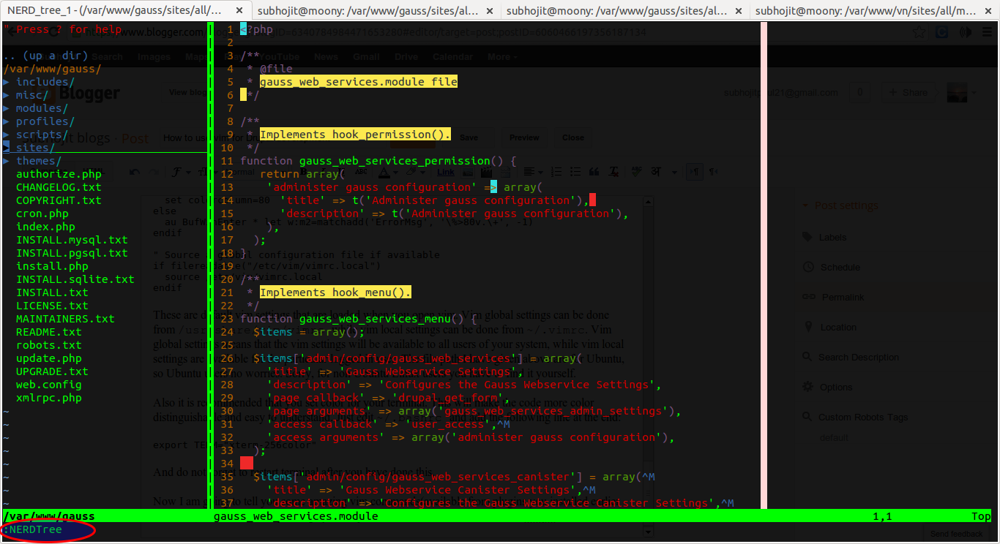
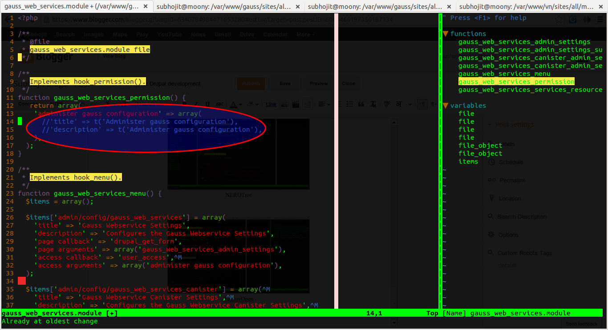
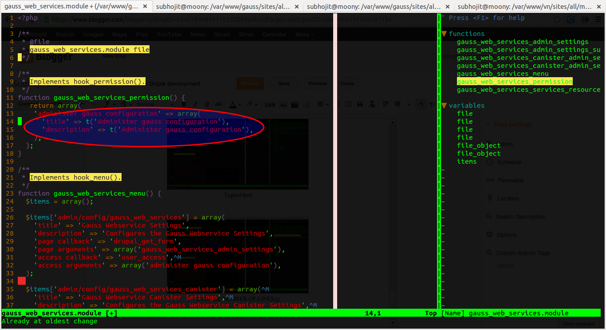

I am a Linux user, and a drupal developer too. Its been months I am using [vim](http://en.wikipedia.org/wiki/Vim_(text_editor)) for writing custom drupal modules. Before it was [eclipse](http://en.wikipedia.org/wiki/Eclipse_(software)), eclipse was good but I was having issues because of two reasons. First, I was working on a big project with lots of custom modules and huge database. Loading a module in eclipse editor took several minutes and secondly, my computer is a bit old Intel Core 2 Duo processor and 2GB RAM and . I have always heard being vim as one of the most powerful editors, but I realized it that time when I switched to vim for writing or just reading the code of custom modules.

Like everyone I googled for the vim support for drupal. The web pages that helped me most are these:

*   [Vim Plugin For Drupal](http://drupal.org/project/vimrc)
*   [Configuring vim](http://drupal.org/node/29325)

Non Linux users can also [download](http://www.vim.org/download.php) and use vim, especially Windows users.

One of the recommended way to install required vim plugins for drupal development is to install them using [drush](http://drupal.org/project/drush). I had also installed vim plugins in this way. After installing drush, check drush version. Command to check drush version: `drush --version`

If drush version is 5.8 then it is okay. Otherwise you need to [upgrade](http://drupal.org/node/901828) drush.

After updating drush, install required vim plugins using the following commands:

```bash
drush @none dl vimrc
drush help vimrc-install
drush -v vimrc-install <options>
```

The first command will dowload the [vimrc](http://drupal.org/project/vimrc) project. The second commad will show you the options for installing vim plugins.

But I installed it without using any options. I just did this:

`drush -v vimrc-install`

This will install certain vim plugins that will turn your simple vim to cooool vim. Absolutely ready for writing custom module. But you also need to configure certain vim settings so as to make it more developer friendly. I am providing my vim settings. Beginners can copy the settings, advanced users who knows tweaks and tricks of vim settings can make changes as they desire.

These are default vim settings that are loaded when you open vim. Vim global settings can be done from `/usr/share/vim/vimrc` while vim local settings can be done from `~/.vimrc`. Vim global settings means that the vim settings will be available to all users of your system, while vim local settings are available for the particular logged in user. The file path I have given above are for Ubuntu, so Ubuntu users no worries. Sorry, for non Ubuntu Linux users you have to find it yourself.
Also it is recommended that you set color for your terminal. This will make the code more color distinguishable and easy to understand. Just edit `~/.bashrc` and add the following line at the end: `export TERM="xterm-256color"`

And do not forget to restart terminal after you have done this.

Now I am going to show you some amazing vim commands (available from plugins you installed earlier of course) that will seriously change your experience of custom module work in Drupal.

[](../images/post_5/vim-nerdtree.png)

[](../images/post_5/vim-nerdcommenter.png)

[](../images/post_5/vim-nerdcommenter2.png)

Frequently used shotcuts:
`daw` - Delete word under cursor
`caw` - Delete word under cursor and go to insert mode
`d$` - Delete from under the cursor till end of line
`c$` - Delete from under the cursor till end of line and go to insert mode
`START-LINE-NUMBER,END-LINE-NUMBER"+y` - Copy lines to system clipboard
`gg"+yG` - Copy all file content to system clipboard
`CtrlXO` - Autocomplete

**Frequently used commands:**

`%s/TEXT-TO-SEARCH/TEXT-TO-REPLACE/gc` - Interactive find and replace

View documentation of a Drupal function:
Bring the cursor at the start or under the function whose documentation you want to see. Then do:
`<Leader>da` - To view the documenation in [drupal.org](http://drupal.org/) OR
`<Leader>dc` - To view the documentattion in [drupalcontrib.org](http://drupalcontrib.org/)</span>
The most wonderful thing I like about this is, it will automatically identify the core version from the module's info file. Suppose you are working on a 6.x core version module then it will show the documenation of the 6.x version. Cooollll, Right?

**More information:**
Drupal vimrc installs the following plugins:
[pathogen](https://github.com/tpope/vim-pathogen) - This plugin helps to manage your other vim plugins
[nerdcommenter](https://github.com/scrooloose/nerdcommenter) - This plugins helps you to comment out line of codes
[nerdtree](https://github.com/scrooloose/nerdtree) - This plugin acts like file explorer in eclipse where you can easily navigate through files in current directory
[snipmate](http://www.vim.org/scripts/script.php?script_id=2540) - This plugin provides code snippets. Drupal vimrc later adds its own module snippets in it
[syntastic](https://github.com/scrooloose/syntastic) - This plugin provides syntax checking. Before writing to any file it will check syntax. Do not write and quit at the same time otherwise it will not be able to show errors, if any
[tagbar](https://github.com/majutsushi/tagbar) - This plugin displays a list of functions and variables declared in the file
[fugitive](https://github.com/tpope/vim-fugitive) - Git wrapper

Other than this I installed another plugin:
[SearchParty](https://github.com/dahu/SearchParty) - This plugin provides color highlighting during text search
[colorschemes](https://github.com/flazz/vim-colorschemes) -  A set of vim colorscheme

**Update:**
See a collection of vim plugins and settings for Drupal development in [Use Vim as IDE for Drupal development](http://subhojitpaul.blogspot.com/2014/10/use-vim-as-ide-for-drupal-development.html), also see them in action.
