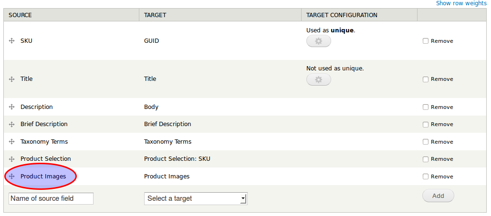
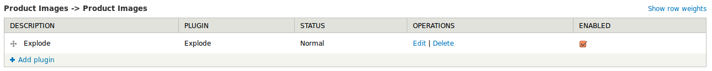
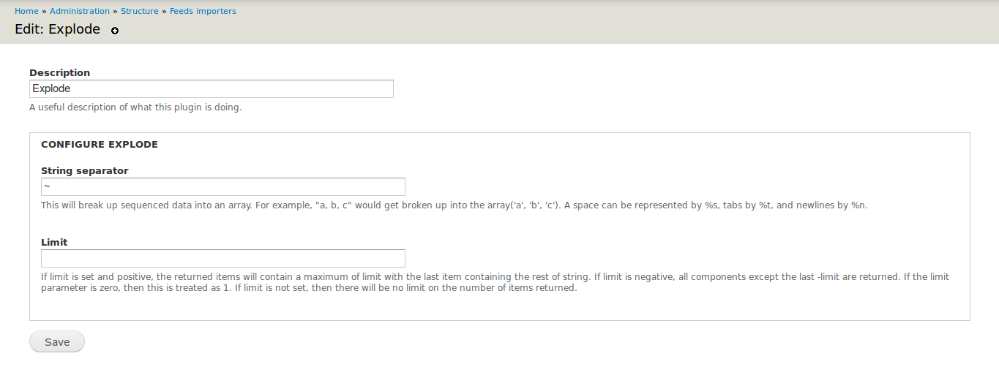

Importing text content using Drupal feeds module is easy. Importing images using [feeds](http://drupal.org/project/feeds) is easy too but it requires a bit work and it is not as straightforward as importing text content.

At first you have to copy image files on your server, you can copy them anywhere inside your website directory, but I prefer copying it to public files directory(`sites/default/files`).

After you have copied the images, you need to create a CSV importer. Inside that CSV importer we will specify the path of the image. Look at the feed importer:

[](../images/post_4/import-field.png)

Product images is the important thing in this feed importer. Product images is an image field.

Here is the CSV importer:

```bash
"SKU";"Title";"Description";"Brief Description";"Taxonomy Terms";"Product Selection";"Product Images"

"IMPORTED-PRODUCT-1";"Imported product display one";"This is an imported product one. This is an imported product one.";"This is an imported product one";"Clothing";"IMPORTED-PRODUCT-1";"http://mysite.local/sites/default/files/_MG_4933-s.jpg"
```

If you have already uploaded the image to the server then you can import data using the CSV.

This was about importing images using feeds. Suppose, the field accepts multiple images and you want to import multiple images using the importer, then you can use [feeds tamper](http://drupal.org/project/feeds_tamper) module for this. Look at the feeds tamper configuration for the images field:

[](../images/post_4/import-tamper.png)

[](../images/post_4/import-tamper-config.png)

You can change the exploding character to anything else, but make sure the character is unique and is **not present in the URL of image**.

Here is the CSV importer for importing multiple images:

```bash
"SKU";"Title";"Description";"Brief Description";"Taxonomy Terms";"Product Selection";"Product Images"

"IMPORTED-PRODUCT-1";"Imported product display one";"This is an imported product one. This is an imported product one.";"This is an imported product one";"Clothing~Jackets";"IMPORTED-PRODUCT-1";"http://mysite.local/sites/default/files/compressed/_MG_4933-s.jpg~http://mysite.local/sites/default/files/compressed/_MG_4934-s.jpg"
```

I hope everything is clear. Good luck :)
