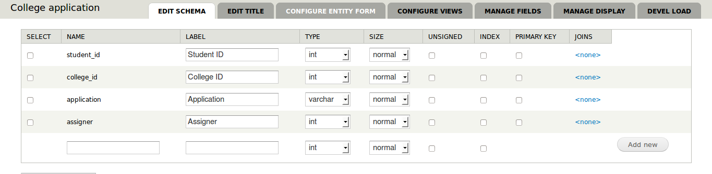

This blog post is about how you can create, read, update and delete entries from data table in Drupal. Data table can be used to create custom database tables. This [module](https://drupal.org/project/data) allows you to create custom database tables and an API for create, read, update and delete(CRUD).

#### Why you need a data table?

I will explain you my use case. I was working on a project where I had to store college information. This "college information" was huge. I was thinking of creating content types and storing those information as nodes. But a node invokes many hooks. My requirement was to just store these information, which will hardly be changed once in five years. Also I did not needed any node properties like author uid, created time, changed time, etc. So it was mostly static. Therefore, I decided to use data table.

Now you may ask why not create a database table directly in the database instead of using an "extra" module?

The thing is, data table also provides views integration. I mean you can create a view for a data table, instead of writing queries. This module also has a good API. Great module I should say :)

So in brief, you can use data table to store static information for a web site and view the information without writing queries.

#### CRUD for data table

Create a new data table from admin >> structure >> data tables >> create new table. Add fields to it. You have to create a primary key in that data table, otherwise you will not be able to create a view for that data table.

I have created a data table called `college_application` as an example. Here is the structure of the data table. Views was not required for this data table, so there is no primary key. Otherwise you have to create a primary key.

[](../images/post_3/crud-table.png)

#### Create new entry

```php
<?php
$table = data_get_table('college_application');
$save_data = array(
  'student_id' => SOME_DATA,
  'college_id' => SOME_DATA,
  'application' => SOME_DATA,
  'assigner' => SOME_DATA,
);
$table->handler()->save($save_data);
```

This will create new entry with given data.

#### Read entry

```php
<?php
$table = data_get_table('college_application');
$output = $table->handler()->load(array(
  'student_id' => SOME_DATA,
  'college_id' => SOME_DATA,
));
```

This will fetch all entries where `student_id` and `college_id` is equal to the given data.
Suppose you want to add an OR condition for values in `college_id`:

```php
<?php
$table = data_get_table('college_application');
$output = $table->handler()->load(array(
  'student_id' => SOME_DATA,
  'college_id' => array(SOME_DATA1, SOME_DATA2),
));
```

This will fetch all rows where `college_id` is either `SOME_DATA1` or `SOME_DATA2` and `student_id` is `SOME_DATA`

#### Update entry

```php
<?php
$table = data_get_table('college_application');
$update_data = array(
  'student_id' => SOME_DATA,
  'college_id' => SOME_DATA,
  'application' => SOME_DATA,
  'assigner' => SOME_DATA,
);
$table->handler()->update($update_data, array('student_id', 'college_id'));
```

This will update all entries where `student_id` and `college_id` equals to the given data.

#### Delete entry

```php
<?php
$table = data_get_table('college_application');
$delete_data = array(
  'student_id' => SOME_DATA,
  'college_id' => SOME_DATA,
);
$table->handler()->delete($delete_data);
```

This will delete all entries where `student_id` and `college_id` equals to the the given data.

That's all.. I hope everything is clear to you.
