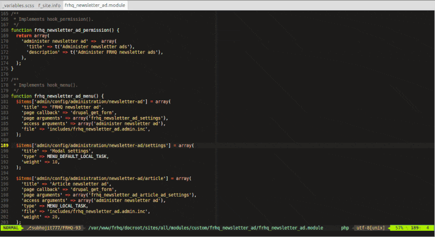
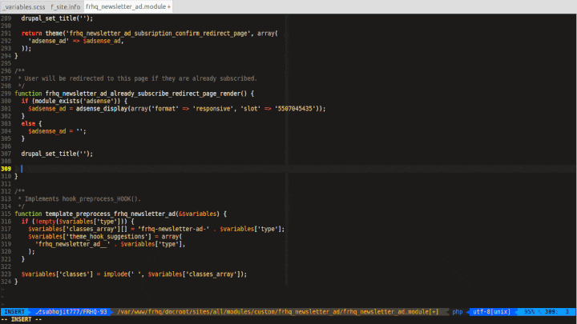
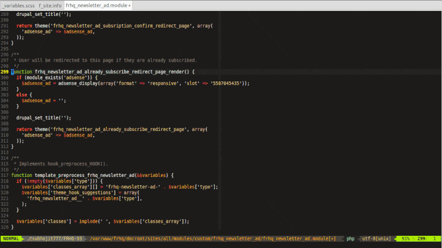
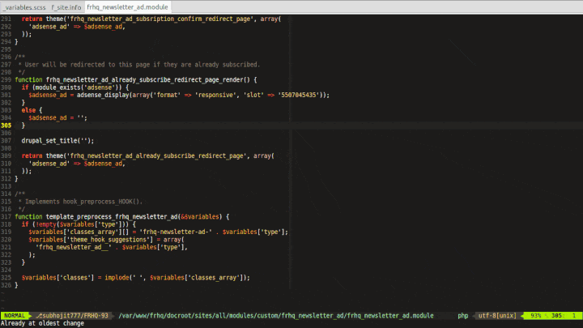

In my previous blog [How to use vim for Drupal development](http://subhojitpaul.blogspot.com/2013/03/how-to-use-vim-for-drupal-development.html) I have mentioned how to use vim for Drupal development. The blog shows some plugins for code completion, drupal code snippets, and other ways for easily writing code in Drupal. I was using [vimrc](https://www.drupal.org/project/vimrc), [some settings](https://www.drupal.org/node/29325) for configuring vim. Vimrc provides a collection of plugins and settings so that you can quickly setup vim for Drupal.

In this blog I will show you my collection of plugins and settings, and to be honest I found my collection better than vimrc ;)

You can find the collection here in my [GitHub](https://github.com/subhojit777/drupal-vim) repository, instructions for installing are written there.

The rest of the blog is about the purpose of the plugins I have used and how you can use them.

## [SearchParty](https://github.com/dahu/SearchParty)
This plugin highlights multiple occurrences of a searched word in file.

*   `*` Searches for the next occurrence of the currently selected visual text.
*   `#` Searches for the prior occurrence of the currently selected visual text.
*   `<C-L>` Temporarily clears search highlight.

These are the features I mostly used in this plugin.

## [Vundle.vim](https://github.com/gmarik/Vundle.vim)
This is just another plugin manager for Vim. Earlier I was using [pathogen](https://github.com/tpope/vim-pathogen), but I found Vundle much cleaner than pathogen. You just specify the plugins in one place, and rest is handled by Vundle.

## [auto-pairs](https://github.com/jiangmiao/auto-pairs)
Another vim plugin for auto closing brackets, quotes, etc. There is also [surround](https://github.com/tpope/vim-surround) plugin that does the same job, but you can specify custom auto pair characters in auto-pairs plugin.

## [ctrlp.vim](https://github.com/kien/ctrlp.vim)
It is the ultimate plugin for fuzzy finder in vim. If you have used sublime text then you will find this feature familiar, the only difference is that you can customize it to best match your needs. Note that, after you select a file to open, you can open it in new tab by pressing `<ctrl>-t`

## [neocomplete.vim](https://github.com/Shougo/neocomplete.vim)
An autocomplete plugin for vim. Earlier I have used [YCM](https://github.com/Valloric/YouCompleteMe) for autocomplete. From usage perspective, they are very much similar. I recommend using neocomplete, because it is much lighter and consumes less resource than YCM. neocomplete is completely written in VimScript, while YCM requires python. Some python script will run alongside YCM and it provides the autocompletion feature for vim, and this is the reason your vim will consume ~500MB or may be more. In neocomplete your vim will be satisfied under ~30MB.

## [nerdcommenter](https://github.com/scrooloose/nerdcommenter)
This plugin eases the comment toggle in Vim. Mostly I use `<leader>ci` for inverting comment for a particular block of code. Other than that, you can use `<leader>cm` to enclose block of code within comments.

## [nerdtree](https://github.com/scrooloose/nerdtree)
I rarely use this plugin :) But I will tell you the unique feature of this plugin. It allows you to browse files within the current working directory. I always use ctrlp for opening files, and rarely use nerdtree. I guess in future I will remove this plugin from my collection. If you are using my vimrc settings, then you can toggle nerdtree by `<F7>` key

## [syntastic](https://github.com/scrooloose/syntastic)
It is the syntax checking plugin, and that is all it does. And like other plugins you can customize it too to best suit your needs. I no longer use this plugin, as it freezes the editor when you save a file. It runs the syntax check in the background, and sometimes that process is slow.

## [vim-airline](https://github.com/bling/vim-airline)
One of the best plugins I have seen. It makes the vim status bar more useful and informative. You can see file format, current branch, file name, etc. in vim status bar. And again, customize it as you want.

## [vim-better-whitespace](https://github.com/ntpeters/vim-better-whitespace)
I helps you identify whitespaces. You can even strip whitespace on save by this command `:ToggleStripWhitespaceOnSave` You can identify whitespace by writing some code in .vimrc, but I prefer using plugins, it makes the vim configuration more modular.

## [vim-colorschemes](https://github.com/flazz/vim-colorschemes)
A nice collection of vim colorschemes. Choose between dark, light colorschemes and make your vim more sexy :p I am using solarized-dark, my other choices are badwolf and molokai.

## [vim-fugitive](https://github.com/tpope/vim-fugitive)
It is said to be the ultimate git wrapper for vim, but alas I am not using it much. If used with vim-airline it will show current branch in status bar.

## [vim-session](https://github.com/xolox/vim-session)
A nice plugin that helps you to maintain multiple session in vim. Suppose, you are working on a project, you are writing some custom module and want to finish your work tomorrow, so you will want vim to open the same module file for you the next day, vim-session will do that for you. It also allows you to jump between sessions. Earlier I used to manually open files in vim, and I find it cumbersome.

Commands that I use frequently:

`:SaveSession mysession` - will save the current session

`:OpenSession mysession` - open your session

## [vim-snipmate](https://github.com/garbas/vim-snipmate)
Expand if, for, foreach statements with the press of `<tab>` key.

## [vim-snippets](https://github.com/honza/vim-snippets)
A collection of PHP snippets, it also includes snippets for other languages say javascript. It works with vim-snipmate.

## [drupal-snippets](https://github.com/technosophos/drupal-snippets)
Thanks to [technosophos](https://github.com/technosophos) for taking the effort of writing drupal snippets. Now you can expand `hook_menu`, `hook_form_alter`, `hook_block_info`, `hook_permissions`, etc. in the blink of an eye (press `<tab>` key). If you are not finding snippets for some hook, I recommend fork [technosophos](https://github.com/technosophos)'s repository and add your snippets there. Or you can add pull requests to his repository.

You can find the plugins and settings in this repository [drupal-vim](https://github.com/subhojit777/drupal-vim). Please star it, if you like it. Fork it, if you want to add more features.

**Thanks for flying Vim :)**
