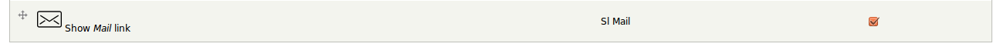

In this blog post you will learn how to create mail share using [service links](https://www.drupal.org/project/service_links) module in Drupal. We are going to create a custom module for this.

`sl_mail.info` file:

```
name = Service links mail
description = Service for sharing by mail
dependencies[] = service_links
core = 7.x
package = Service Links - Services
```

`sl_mail.module` file:

```php
<?php

/**
 * @file
 * Service for sharing through mail.
 */

/**
 * Implements hook_service_links().
 */
function sl_mail_service_links() {
  $links = array();

  $links['mail'] = array(
    'name' => 'Mail',
    'description' => t('Share this post by mail'),
    'link' => 'mailto:?subject=<encoded-title>&body=<encoded-url>',
    'icon' => drupal_get_path('module', 'sl_mail') .'/mail.png',
    'attributes' => array(
      'class' => array('service-links-mail'),
    ),
  );

  return $links;
}
```

You will need a mail icon. You can download any mail icon from [iconfinder](http://www.iconfinder.com), and save it as `mail.png` under the module directory, like this `sites/all/modules/sl_mail/mail.png`.

Enable the module. You have to enable the service from service links settings page here `admin/config/services/service-links/services`. The new service will look like this 

**References**: See this [documentation](http://servicelinks.altervista.org/?q=about/customizations/extend-the-number-of-services.html) of service links module to create custom services.
